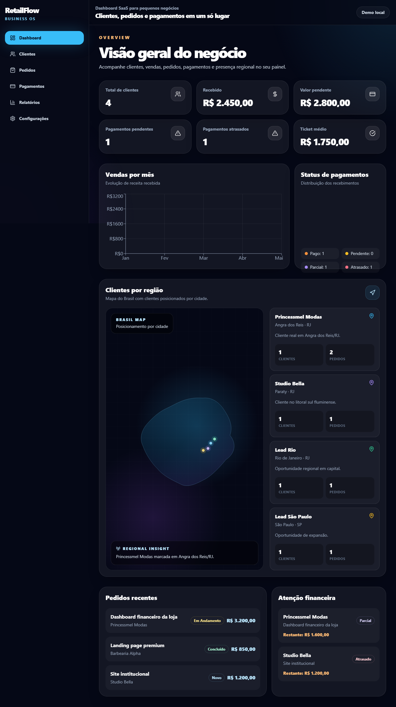
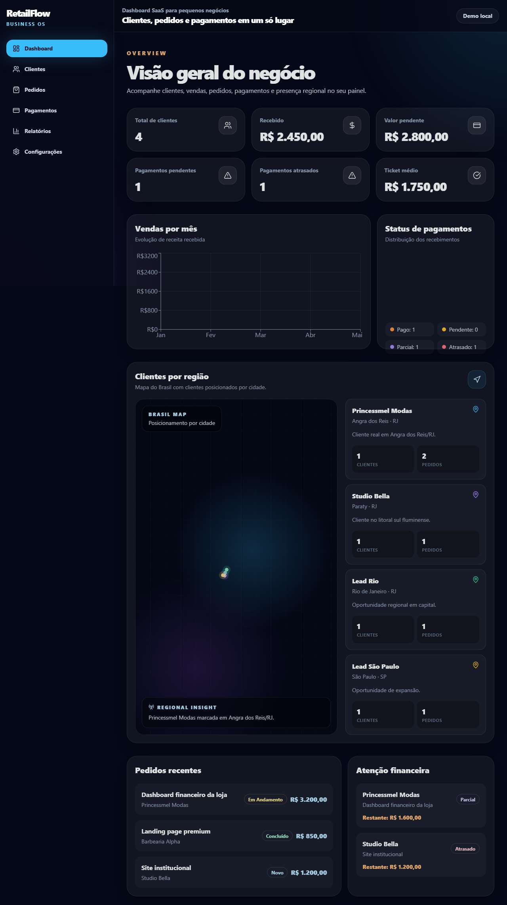

# RetailFlow Dashboard

**Dashboard comercial em React para gestão de clientes, pedidos, pagamentos e relatórios.**

O RetailFlow Dashboard é uma aplicação front-end criada para demonstrar construção de interfaces administrativas, CRUDs, filtros, métricas e visualização de dados em um fluxo parecido com produto SaaS.

> Objetivo: mostrar domínio prático de **React**, **componentização**, **responsividade**, **estado de interface**, **CRUD** e experiência de dashboard para vagas de Front-end Júnior e estágio em tecnologia.

---

## Links

- **Deploy:** https://retailflow-dashboard.vercel.app
- **Repositório:** https://github.com/Juniorsilva-tech/retailflow-dashboard

---

## Screenshots




---

## Funcionalidades

### Dashboard

- Métricas principais do negócio
- Receita recebida, pendente e pagamentos atrasados
- Ticket médio e visão geral financeira
- Gráficos com Recharts
- Pedidos recentes e alertas financeiros

### Clientes

- Criar, editar e excluir clientes
- Busca dinâmica
- Filtros por status
- Badges visuais
- Layout adaptado para mobile

### Pedidos

- CRUD de pedidos
- Status de pedido
- Integração com clientes simulados
- Controle de pagamento
- Filtros dinâmicos

### Pagamentos e relatórios

- Controle de valores pagos e pendentes
- Marcação de pagamentos como pagos
- Relatórios de receita, clientes e indicadores
- Cards e tabelas para leitura rápida

---

## Stack

- React
- Vite
- Tailwind CSS
- React Router DOM
- Framer Motion
- Recharts
- Lucide React
- localStorage
- Vercel

---

## Estrutura do projeto

```txt
retailflow-dashboard/
  src/
    components/   componentes reutilizáveis
    context/      estado global/local da aplicação
    data/         dados simulados
    hooks/        hooks utilitários
    layouts/      estrutura visual das páginas
    pages/        telas principais
    utils/        funções auxiliares
```

---

## Decisões técnicas

- **React + Vite** para desenvolvimento rápido e simples de manter.
- **Tailwind CSS** para construir uma UI responsiva com consistência visual.
- **React Router DOM** para separar as áreas principais do dashboard.
- **localStorage** para persistir dados localmente e permitir CRUD funcional sem backend.
- **Recharts** para transformar dados simulados em visualizações úteis.
- **Componentização** para separar cards, tabelas, filtros, modais e páginas.

---

## Como rodar localmente

```bash
git clone https://github.com/Juniorsilva-tech/retailflow-dashboard.git
cd retailflow-dashboard
npm install
npm run dev
```

Acesse:

```txt
http://localhost:5173
```

Build de produção:

```bash
npm run build
npm run preview
```

---

## Status atual

- CRUD funcional com persistência local
- Dashboard, clientes, pedidos, pagamentos e relatórios implementados
- Responsividade aplicada nas telas principais
- Sem backend real neste momento
- Sem autenticação neste momento

---

## Roadmap

- Migrar persistência local para Supabase
- Adicionar autenticação
- Criar rotas privadas
- Adicionar React Hook Form + Zod nos formulários
- Criar página individual de cliente
- Melhorar acessibilidade e estados de erro
- Adicionar exportação de relatórios

---

## O que este projeto demonstra

- Criação de dashboard com React
- Organização de telas e componentes
- CRUD completo no front-end
- Manipulação de estado e persistência local
- Interface responsiva para uso administrativo
- Apresentação de dados com gráficos, filtros e tabelas

---

## Autor

**Maurício da Conceição Silva Júnior**  
Front-end React Júnior | Estudante de ADS

- GitHub: https://github.com/Juniorsilva-tech
- Portfólio: https://mjr-forge-portfolio.vercel.app
- Email: mauriciojr07052006@gmail.com
